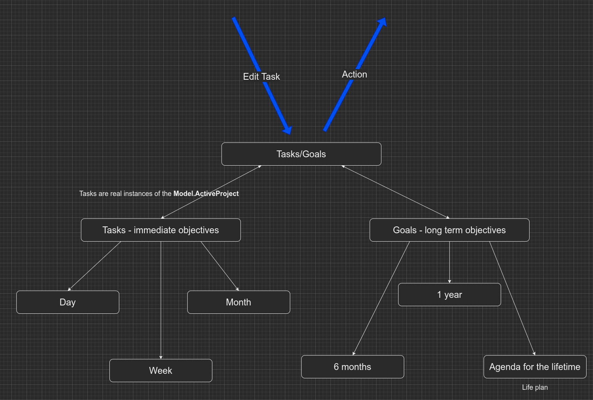
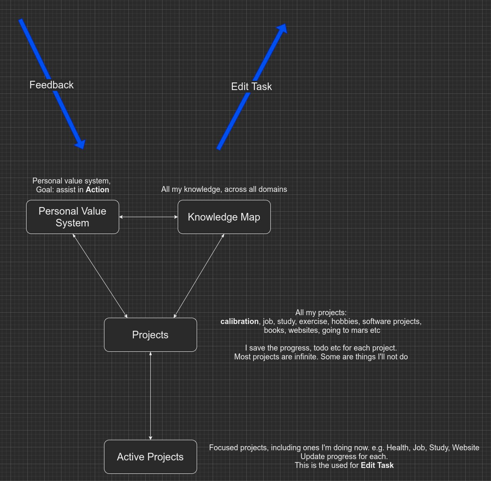
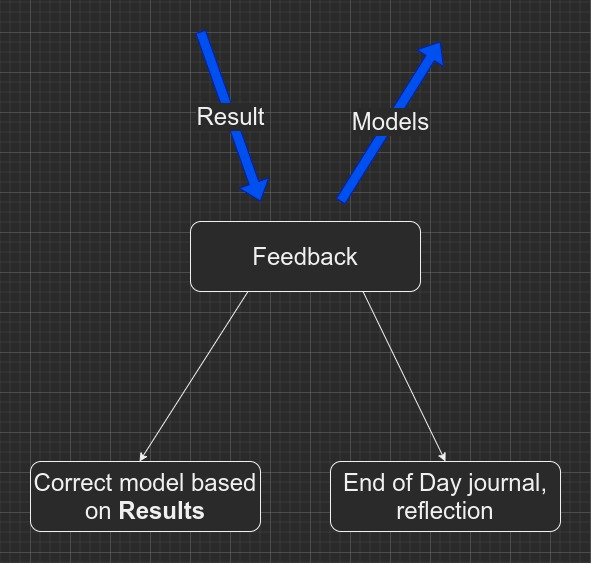

# life-flow

## Why

I can observe that I do the same things everyday, so why not understand the process and automate it.
So I modeled the workflow of life, as of now.
Of course, it's not static.

## What

A simple workflow for life, for homo sapiens(at least).
I'm experimenting.
This is a simple workflow for living life.

## How

This is just a skeleton, it doesn't have any content.
A real working flow can be obtained, by plugging in:

1. Goals
2. Personal value system
3. Knowlege map

## Usage
Open the `calibration_idea` file with [Diagrams.net(previosuly Draw.io)](https://app.diagrams.net/).

## Some Screenshots

<a href="https://viewer.diagrams.net/?tags=%7B%7D&target=blank&highlight=0000ff&edit=_blank&layers=1&nav=1&title=calibration_idea.drawio#R%3Cmxfile%20pages%3D%228%22%3E%3Cdiagram%20id%3D%22nVED_cFmHkKYGcl0D_A5%22%20name%3D%22high-level%20view%22%3E3VrZcuI6EP0a6t77AGW8sDwCAZKZJGQGyPaSErZiKxjLyGL9%2BivZMl4BBzKZVB4orJbUkk53H0ltl5TObN0nwLVusAHtkiwZ65JyUZJlWaqr7I9LNoGkKleFxCTIELJIMERbKISSkC6QAb1EQ4qxTZGbFOrYcaBOEzJACF4lm71iOzmqC0yYEQx1YGelD8igViBtaFIkv4TItMKRq5KomYGwsRB4FjDwKiZSuiWlQzCmwdNs3YE2Ry%2FEJejX21O7mxiBDs3pMPYgGUzeOCayZIMJM4zfqCTXbNa%2B%2FYodXuPRjVhqbb7AYUXZ8w3RYg1k1V1HlezJ5P8j4E29UBUbM9AW1AUTs5EzDUY0AAVMl4%2B03GPzlzu6Q4dyX1OXF8t1T2%2F18N3Dj6jbCBATijW9TGzAFPl14dJ%2FTVvKzXI2N%2Bv6y01HRxaZ%2Fi7LO0h3UEVrkwleOAbk%2FatshisLUTh0gc5rV8xzmcyiM1tUZ5EVYC8hoXAdE4nx%2BhDPICUb1iSsDa0u%2FF5uiPIqcqJdGyvmQDUhA8JvzZ3qyLTsQawxLMaMfdD4XQNxCWXWK2Cl%2FhXtPTzJox%2BuXa%2B17xf1xe%2F7M61UrR00EzRY8Imigx32144sJ7ESJtTCJnaAfY2xK%2Bz1BindCOoAC4qT1oRrRB959wobPCg%2B%2BUVNE8WLtdDuFzaxwh0kiMEPSShzmCkCZVpYfIrXRar8UqiLh4eYoKwe8jAPL4gODwAo2JPGwN8fDrLEAT3orwTagKJlku3ynM%2Fv2iIEbGINXIwc6sU033FBFAaymgyDakNKOXKgMXLr3dTO9PSPoTmxoZ1Kcx2CbFK97S7nW2hMpl338vbcAFIPx49ts42Rhw3bbVwu1G28MD6F8hQlaWs1h%2FGaOYxXVf4o5X2MI7R0irBzuic8rW%2Fmj%2BTZUMzB%2BmJIGnfg%2BulMT6gf9ITQ%2Fq82XLf4OcjnJEM8MrcAnof0fKasJmnyMEvuGDHBhxE97mHE0xlQLsiAjYIMGPNPLcc9Q9n7iDLLhFoyOpS01wfrFr3i5760okZKUTWlKAAmo%2BgLsmsPMlYE%2BvT0sLp7u1G21%2ByWUO%2FfXg%2Bave3js3tmWDW%2B1Dmy9qXPkWJ7PGomS3eeldbzr58d%2FeflJdxMnNbk3IOkcngjPEJ16QNZdEjU4uRXkPoqjbr2PvrzS%2BnT5emc2CjIieqX4sS6lKIy7UROVFPHTKVRjBPfe5ytpcaRpY8%2Bzmau%2BdvVy%2FOv1eipPLp31PHVTWdhw3JII8BeJLGPRQAjGJr0eWAj0%2BEBwdyL%2B1yb0xDSgd0SFTNkGLZ%2F54KMusHEV8UdU%2BDC9GrtknbBdbFrVkDv6XDyL1kfwHzV1HFSbmaZL4%2F45PcTXzHQ5Qzo8rcDXWkc324%2BFXQlA7ry7UAvssd%2FKuhqBnT124GupTMT2l8GXcuArn070NP08pmOfqsog5ftYj4dy5uV16w7PS1nHx17%2FvuA1reDvpo6a2nVLPb1P4T9cKPczuWXsWu6T%2B3e21V7u%2B7nYB9eAw20zL1TchOUBer8UmnDV5q9VMYuk76ipNRzgZOWfcx4cc3VSonjtptI3qiTvamlyZFJgxm%2FZzoTj%2F8hj5%2F7scv9gyBMEN1Ujoycj8yexh8PjvxecJZsTazLNTZNFmeFceq8Y5h0nveIaslHfeFBdrntgSVAth%2FdLEr4ZQGyqOQTdi3gwWPGmJBi5jnPDkol7Tcjy1%2BDvtH9ifsFAl0IKF%2BUNAMOXwJl91NeYywIckwusHhrw781lXm%2FCl%2BhhOg%2FvJmD%2BfoB%2B2FHh2VQDhpSi3WuZFes8q5DyDXOMIExe3EVFoGviaXmJBaMt86g8fjwfNN0Jkva6W8RusquPrimYif%2BwhIcgz3F%2F8nXUEcSP2n%2BZobXOX7KhfyH2Dwn2V7Lu7mfkmzP8LkzGM3nzXG3PhuUu3A8mL%2Bys0yWz2vfbxNt%2Fr1Do103H5fNH5O31vB%2B80CftckI5W6iKcxN5rnunoXuPpsQuJZ2M83AtB8TVUtgouTc07VaDij194OyLx2Z2SX%2BBfYKbDglDW7%2FKx1PUHacfqs%2FfXukwKFYv5y9%2FAY46nZaglKKwZZNUMZiYPdhiOSTnGftaCZ8iTNbm%2FzzmsoEY%2BpR9lghxE8ZtYnwcJ5vfEW23cE2Jv4ISrfZ7XR7XAsleArDGvFaPZ0AFRTVxpTiGRPW8hOSB73weByFdFXQRU6ImyI5tXx7FYilM43G9%2Bb2ggHsHLbcRVtuqMo%2By%2FlEGH10lP%2Bi4YBLFjJUnNDy9pHQMoUzwGftLdnUW%2F2r7y1nBkr6M6KP32BYMfr2LMhVR5%2FwKd3%2FAQ%3D%3D%3C%2Fdiagram%3E%3Cdiagram%20id%3D%22djCO8XWZM9nbvtCGziiI%22%20name%3D%22relations%22%3E7Vxbd5u4Fv41Xk0fnMXF18ckbaadaWe6VnJOO48yCFAjIwaEHc%2BvP7pxlXCc2thOch4SGwFC2vvbt0%2FCA%2Fdm%2BfhbCpLoK%2FEhHjiW%2FzhwPwwcx3acEfvgLZuixVYtYYp81VY13KF%2FoWq0VGuOfJg1LqSEYIqSZqNH4hh6tNEG0pSsm5cFBDefmoAQag13HsB663fk00i2zsZW1f4JojAqnmxb6swSFBerhiwCPlnXmtyPA%2FcmJYTKb8vHG4i59Aq5yPtuO86WA0thTHe54SMNfJh%2F%2F%2Fb5r3to%2FyddDu%2FXq6HqZQVwriY8cCaY9XcdENYtGzXdKFFM%2FslJcWKYCUVdsQvsScK0fV2dZ99C%2FumBPGOaY6pJIaCIxOwrCfiQU%2FKTq0o9iI1YPkvepoRVPtaBPlOIOiQpjUhIYoA%2FVq3XKcljH%2FJpWuyouuYLIQlrtFnjT0jpRqEL5JSwpogusToLHxH9Ufv%2BN%2B%2FqcqyOPjyqnsXBpjiIabr5UT%2Bo3cUPq9vEUXEfn6saiD0p58sn2alX1ZSRPPXUVX9nHzbB71%2F%2F%2FGl9nyGMxncPP0ihTArSENItSndK9DG7hWQJ2fjYfSnETE%2Br5jiAsp%2BwvK689RtBAiKlsY9deY%2BydbcwhaIPOTB1W4VU9qU2jqpJ4Pc5WJ72B%2BY1Es%2FPKEOUY60jGEsg%2B7knOmaCywLgUcIlJJ%2B5SCtI74b0fnDcC4pPgFp7Zoatgp91aVmOAuDeSHaaSLad3ZBc9VRcSIIgg%2FuifZvYamAPCcC698SYhUruJdcRovAuAUIZaxaum9gx%2B6UVTCl83K7jTpXMraYYnYkS47qKpKVoo1oUnVndKmvI8bkuwu3PQ0RssK%2FPzg8Trbqj0A52P%2BonWo1mLXC6x41Wsx4zL55widSLguzhtLC0Xyssp3vCci8%2F5oz7Q08IY5hK%2FNySnCY53RlBR0zVq%2FT8Oc6vAlaJzYMnOXuhqivJ2dfbuXYroxkf19s5Gl7LKvCMEhathDl9xjLSBBcT6dvrtfRF9v68BDketfA2O7Ug9eJQBceXJUh3dGpBFsxcTZJ%2BnqI45A%2FzFNFTCyIvg85p6%2B64hbFR0PNdY0YHhPaNGXbLGU6OHDPsHpMcFKjsmE3pponXs2Jv%2BkmfTwHSST8gdVqJzaw%2F0hGEN2Q4XqW%2F3f93%2FIW41398pXho90gp5In%2Fa3n4CyIY%2BoWiWWUd%2FHeNSLSU6%2FlVdB6U%2Fts22VY6c1a5S5v%2Bm9gnT1100jSA0F8A77wkp9UhZyA63c%2FFTHQ8fy4XP2Tqt0JgUFsbaYmVCYU25ZfRlDzAG4JJylpiEnOZBwjjVhPAKIzZoceECFn7NRcx8gC%2BUieWyPdxl8KaLvEQ6LZnDRWV67w1Fc0NGmrTjIfT0ETTECahIQE%2FJ2BPpycHtk7EdmH3rCTnnlpwjs7pHHYxxVqCeHOG1OMxdgkcMC0qt808uS3ANSNw7zpy0l5NPTb5qId9FK%2BYIEm6GTKQgZDFk3My9nbmxKqc8amtXY%2F%2FL8JN2s7JUydHD8wBS2yEfwOhJM7k2n2bevDIMsFQ5lVP5lG750cpZC4YLERX3Nkk3PDErMfXg%2FEH3hdzfpnSzDNStF7i3HhH%2FY1601%2BPS7Vlif%2F%2Fwn6LAqa7RrB5TxGstVdgfuQA5trHQcLZs407I8Ht4Hj2phvbkdlqu52%2BoXAMvnH3lPsLWEDcXxzqDChqu7e6eVAW33VQbTGlzvAztC7tqWU3dFwsXp8vGejoi5tnyWu189r5yVeFHZ1HfRHr6%2B0saTY%2FtSRdnQ54EQvsWsFg7Zpw9idKvWB4to93Onz8EvDJLyAfN%2FtjSTyUK6ARSP01E5s8EhQuoF404DNv1yUsl2AxOOKdLNUrPxcPMVljEeSZwtNi9O8vjR3ciisyiDky8kw9VHQrhpax0bDkxrnN%2BPs6qsMFodGl3td9BFMxkmpmqjIVOyAjwAXGEpmMf2JC2FM38nl6X%2BgS8gEzF6BkwOuyYYvgVr0bhrJr5Hy1xZs9bxmTa6i%2By0qtbkzz3oxJj40ewRh6rVeSBGAMOpWw8jk0SULRkgmf36nz6q9VqTNNp66BjDLptLeK3NUr8ox1zaeFoAcLrWISIm%2FIUkUfSWWbjV44l8r9WUsIhJMV7kja%2Fka5ArM3u48QdzXiX5JCD0kXY%2FkwQDH0L98MVGy3hRXDZjXHMiBl0htS9Pyu%2BQ7iG9FMe7VyaumamRoUc4jVSuMmDD1bFOYjYq7Yi4W7zPUBxX5p4Wi5QJ5QIatclzB%2BOxqdzZoaNfKk45688pZ9NS9viWB0zE3eZsmZ3lxtiSxMSZ50Tn8XPuSZa06jqauJZVS8eBI13nmf9uS9C6j2QXbZPJZ%2FAknCQnRm2Pbp8PP3RDiZFU8LLkjCt4jK9ZpskzF%2FMyjfsOKuCsUezn11HlF1JWKu5L3evVt2rxZ5oEox9tiB2u3qMAzo%2BTq6LTbRbcXjpg1PdazaBhOe9mbC%2B9fszqgDqt9ZDftOFrMFSooAKFsUGt3b11%2BAPgsrNTS4Rw2FjslxndqhTww71KYTg1icybgvK%2Bk0Eh%2BtjDbCkTpU4ORGojyZbiRFR1kC4mcFBovT5KFYT2O1okDklfDmrGgEeOuzKhf9%2Bd2yFQGoLAr%2FyWGmmIaMnRa8W8AtTOa6WDBNwpTL1RcRS6TBpxBgWUqiIEBejqkxJRaVagRWBavHsuFUhZ9ELUIgMYJcEHpAdqImxaxvmBAM0vo8lUvZwnFVLVe0dEQLGKI4lk8msRi5eslCMnB8TheFHNb8H99Eyh%2FHARbJG9M8jjnuOXc4AUueEcaLLDE%2Bu%2BbwpOJ3BMPTOrd2TSQ%2B8%2BlXr1xz72xdFl%2BkZOLGFar2tLaSCQvI9IkENVEWRnmMGJyELD2YVJRGIdCCb1cyVXECiHKpLHhrLKsckm9Q8oKuZdcqgbeKYfzMs4IarfEqBctaTLnUtXx2Ma6L4ryYFmGCSdco49mRJZmXgCkgi4wjOgNF64MqNCmsL1MwHgj%2BGGad6D3hFK5zWgPgu9pPBCgNIB79uccSljiU8E2huFLR9VKL72u30iI%2F4XFceL44vHxitqxZuPxma2eqdEB%2F39VR%2FxHo%2BYHmypcmJqPATUMdStjirQ9LbiiDQPp3EYiFfQ3KooLVL6qBqSsujLVjfeY%2Bgpn0555EtHTvjjBnadRuKliYFadq8KCkR39B6d0Xv6UctvabcMZ6x2okc45OwU9NGW6PbM%2F%2Bu%2BI6C55PZM1zHgKroqcsuKurRZZTu%2FnNlj9d0KmXP32tz5gHZMrzjeWPRlH0WhA1bcieGwqisYn4OwjDZZaUzpkejOG6F4YTsWmIqLUS6%2FQrBNcD9bOXcqVfsukqNvB2EesjYYKKcCgIeSvARCaGT%2BXlC5Fo%2BCR%2BJ1JOgHmQAgsimwEFqrMqSRSZh1xjF41eSrK2%2BRvywjuezQLfFxkv5WGrl3X5F0igPWENTtMYDCt1I9Pra70RaIYXDA5IoG0kSgbFLj4Jspj%2FHusBosbrQ4fhfZNy%2BWPPEMIOqx%2B9lTsgq98Odj%2F%2BDw%3D%3D%3C%2Fdiagram%3E%3Cdiagram%20id%3D%22CnGAGkjXtantocHm_Rao%22%20name%3D%22Activity%20Logger%22%3EtVXbUtswEP0az7QPYXyF9JGE0KYzEKbQ2xOj2BtbgywZSU4CX99dWyYEpZ1Cp0%2BSzq5Xq3OO5CCZ1tuPmjXVhSpABHFYbIPkLIjjODxJcSDkwSFJ5JBS86LHoh1wzR%2FBgaFDW16A2Uu0SgnLm30wV1JCbvcwprXa7KetlNjftWEleMB1zoSPfueFrXp0nIU7%2FBPwshp2jkIXqdmQ7ABTsUJtnkHJLEimWinbz%2BrtFASxN%2FAyK25PZovRfHSR%2Fbz5cS%2By20s76oudv%2BaTpyNokPbNpSH8MM8f776dzufzr5%2Fjuy%2F3sBhKr5loHV%2FurPZhILDUqm3%2BsoOhHGgL20PysuVQdscgeg9UDVY%2FYN7w1aCPs90oClOHbHYqZmOHVc8UTAbnMeec8qn6jh2cOIJeoUPikXXFjOFr6M5XN0oSO%2BjvitGgIVe6MDgDJIQOx3LL19zSlEu6VGAZx22nPWdLZnnt8Y%2F0ywKoryhIJpuKW7huWE7RDd5ZxCpbCxdeKWndHYxTXPu6%2FdEGL3X7rT5J5omRHhLj6Tb9ixgHWw49MWYsr4hs2XdaMdNpAYb0YdZqvmwtPUWnQXwssMHJUuOspFl0hDk3zNzhIFkNfkZMGVeaK90J%2BDKcUBjlg3fGMm1HIIv3flZKWbVShR%2FKjjrZmW2pbbVynhJguZJ%2B%2BvFRd1TQJZ1VoMOEn3RCSVNV18iJ8cNjCs%2Fkmmsl6966I%2BqvNTzHcXGJwizOz3t%2FCpWzvhVamVZ3vuSyNJ5j0UN235ZM8FLiXMCKIuQzjk%2F0qYNrXhT08USD4Y%2FujQhx3ShOnWPVbBJkZ1Sptcr0Bn%2Fh92j8H%2F2eZnvPURT5j1F6fMD%2F8Rv8j8vdT6WLPfs3J7Nf%3C%2Fdiagram%3E%3Cdiagram%20id%3D%22cntS2G54vDvxFcAFoPWJ%22%20name%3D%22Tasks%22%3E7Vpbd%2BIqFP41PjorF2P00UvtaVe76rKdWuflLEwwYcSQEqxxfv1AAubm2NZaq2fOk7CBLXzfR%2FaGpGb2FvElBaF%2FS1yIa4bmxjWzXzMMo200%2BI%2BwrFOLbujS4lHkSltmuEe%2FoDRq0rpELowKHRkhmKGwaHRIEECHFWyAUrIqdpsRXPzXEHiwYrh3AK5ax8hlfmptWVpm%2Fwciz1f%2FrGuyZQFUZ2mIfOCSVc5kXtTMHiWEpaVF3INYoKdwGd0O2LN33f0%2BClr%2BetCZmjqup84G7xmyWQKFATus66ZcGlsrvKDL4ZPVgAT8p0vJMnChcKPxGqHMJx4JAL4hJORGnRt%2FQsbWknywZISbfLbAshXGiD2J4d8MS1YnuaZ%2BLF0nlbWszEjApEcuQt4YMLpOvViqOlEDRSVzk9SUnzeCJ0GOyJI6cEc%2FqX4GqAd3%2BbPTfgLOnBAlNZeQLCCfJO9AIQYMvRTVCqTovU2%2FzdAhQXwdhiZ3aF1vSHnKDWqruvKRzlQOy%2FTBC7l5ZKZENe9QUPvICnq7gPYVTFl4XySg1qEFVGD%2BvTTr%2BpF5tv8aolWkPBGm5bRfAF7Kf6oZTcwX0I1CEPCyJ8oPIJpHvFtduFssoIsAg7xMpj95FOeTjNQoPon8wIqMMs0Illc%2BYvA%2BBAmyK56TFPXxMcpeIGUw3omxeqwaZvGxarVlfZUlEQ2VGfi5BKKpfRIvdoWXPlifCZoNrRSkWlU0DfuYaLYqaI4hnJ8JnLplFeBsN78aTvUMy%2BF5y9HwzwNQ69TUqRsVOJviSCIgjc4DU7MEatv6clCtI6cw7zjsnGgKo5tvzWGMk8ph9NaRqf6LmG6eFtPHPn%2Be%2F7nk7VQf%2FA7jY1SblaB4SQBWpxBMAk%2BsCtJF6RxyDuHSOrnzhtroObh1MT8I6HlA2tSKWbJ9zCwZ9J%2BXFxfRCM%2FsO%2FeqHQ%2FvHb9ezeoqSHocyvCDiGwu08FUudV2ItUy98zVNpflh1df9bjb8WDggpp4B0DFRvfFfQNGM8jQAn62JHfy%2Bbokv0xyegXGG46YWBwWdzIl0PgyWBEZgJEX8LLDkYCUG8RikQNwRzYskOviJMbCCP2SihNRLBQ3zslyrG7N6gtfPKxGKcol0Hm%2B9gmgx0rNxcdAVdutLYyYB2CEDn24RuPGuB6vFvi6d2WFnXr1pKzu0vjKk2AKEh9BxEDgiPilkdlG7%2BpWbaru05JXdt86SawbUiKiXu7mbfrHa7cTo%2FpQ13aNItmWviWMNj6J7mg%2BG5HJmKFZ3Iqx4ZNR93qTlf2HDp1cmJR1xLtZbphi4swffBSohgHCWx6re9CeT2S3QispezWPlTfax09jt866GvPP%2FsByboJQJ4kTUUQ1Iux44zKQZ54zfrlSfmVtfuJZ53sE6d00jYoaBlOIiwiLNRcgaz4viWqopyGswzsYjTDOGhXeFy4SowU1OUZSn3lGMArm6f%2B6gAHuMflqxRhwWRi9yys2GE%2BMh%2BsQ283u49Jejh6zYQ85Mf875UmbfEmhFPVkr0j7%2BhebPvodzulqqP1w63n8pQJzooh8EIriDMNY7lq%2BoV21gR0Mogg5f9RGsnNnfFP3COaZuHBpapqlwVmy4ymZw0KL3u%2F23q2mV7dmTivWFqko2wc%2Fr9DtolTLCkwfSZWPKyp%2BTKMkebvkaO%2BvNHg1p%2FEjaF6kmiTYX%2B6T%2BPb5if5wTe8u7t%2FT1hDcTD4od%2BN%2FuR9G7g29JNN99W69sm8OKXduyj7CSz1k3zKaF78B%3C%2Fdiagram%3E%3Cdiagram%20id%3D%22YxMqXrZd3gOxDSr8PaLY%22%20name%3D%22Action%22%3ErVXbctowEP0aP5LxBQN9BHMpbdLcmkmmLx1hLbaCsFxJBsPXR7JkbAMzbWb6Aquz2rPS7lnZCaJtueAoT%2B8YBur4Li6dYOr4vu8O%2B%2BpPIweDeL5nkYQTbLEGeCZHsKBr0YJgEJ2NkjEqSd4FY5ZlEMsOhjhn%2B%2B62NaPdrDlK4AJ4jhG9RF8JlqlBR6Hb4F%2BBJGmd2XOtZ4vqzRYQKcJs34KCmRNEnDFprG0ZAdXVq%2BvyO8YSHfzke3D0esv12zIehT1DNv9MyOkKHDL5f6l9Q71DtLD1mpOMiFR3CYmNuHH8AVU5JyuurERbszKnjEi9IwVdJ60Z4fjR5VahElY9iwsBWDc0078cKCr1uqqqPNStklDqqFRuqQI8ZSJKkkzZsbo4cAXsgEuimju2ji3BWIdPOAhyRKuKylXrnJFMVtIJJ0441VyFZMLIU1OvWSatWr2RWv9jjW0v9DmgbCnM1nwBbAuS61ufRig0IYd6beW0b9R4kljaUuLQYsgOQHKibpqsDNvnavkigN%2Bv3vUY%2BS5FK6AmtO6MvnOn5IM%2FBasdPVOcsdrg9%2FOycdbdfAJRKBrLpVIbOuM0Z6Uk25iUGEmkyKrpVJpSzY4e3u%2BC4616EYaLH7f3X%2BbHt195E%2FYT8QTqyq8oUkSVr5Zv8c2Nn%2FijTGcxzyfL8Wv0%2BNJzW6W3cm%2FpSQ1srs01hXKsnxJ1TsiwNacxRUKQuKu4c1msCaURo4xXlIHrhi6sK2lztoGOx5tOok8LCXDn%2BbqUUUsm4RWV1JieKUl23UfvmnRshgc9H41K%2B%2F6ZSoP%2BTdglEazgMdi49jtzRjXo%2F5VKVr2%2BoKrUfLr6NYGrZUvjNdQ8wYah%2BZIFsw8%3D%3C%2Fdiagram%3E%3Cdiagram%20id%3D%22PjM3zL20g7GNLO9FzXZp%22%20name%3D%22Feedback%22%3E7VldU6M6GP41nTnnwg4E6MdlP3R1Xa1O19V60wmQlqwpwRDasr9%2BEwgCLWLV1unMOdyUvEnekOd98n6kDWOwWH9jMPCuqItIA2juumEMGwAArW2KHymJU4kOdCWZM%2BwqWS4Y4z9ICTUljbCLwtJATinhOCgLHer7yOElGWSMrsrDZpSUVw3gHG0Jxg4k29J77HIvlXYsLZefIzz3spV1TfUsYDZYCUIPunRVEBmnDWPAKOXp22I9QESil%2BFyc99ZBmN4quNVy7309Xh8%2BnySKjt7z5SXLTDk8w%2Brvn7kt%2Betx2FoTE%2BW%2Bs1kaC5ApnoJSaTwUnvlcQbgnNEo2PELMnWIcbSuMi%2B0M7U5goJ7iC4QZ7EYp2YZpvoQRTsrs9cqtyHIZF7Zfoo7ijfzF905NuJFwfMOKxhbUF24SKyyiZeAy3eR1KQ3jP7KwxyNA%2BjI3pU4Y0Lm8QVR3TPqc3VmgCna2zjXmm0T51fx1CvgMyrga%2B8Bvcov1l5DT%2BMe5OLnQvoKJN%2FciGF%2FnvQg2YTxFsZi17wMJCR47ot3RwCHmBBIbLBwAz3VscCuK6f3GQrxH8VDTbQDin2ebNfqN6yh1BVxGqZG2bCR3jmEjRTHOztS3NiDjR5ay87t9Qg9BBh4k0lraTN2tM7AMsrOwKhCql3lDKxDOQNzC6qRHSK2hBxTP3yFxGIpjaEZEVvHSyn14oCK%2FhAd3IvU2vtTXqSKod1DMbTCi%2Fghh74jEdToTIZtlDoSnsKPGcMp0RL4G6BFpOewmXibJz4EBoHcIuJOU8jgQmLr26H8uaZKy0KOsDGsstSR%2BaJPWjpL87Qdj9g%2BTpg2nPLbKwbcK25%2Fv49%2FuaTnZyesADRyRWKnmj71E%2FxeTolEjzLu0Tn1IflBaaAQ%2By2oECvIJJhlU6E15g9yehNYqjkpdA3XSnXSiLOGLzaYzrKy5qTYl09LWtk8wVTGezKnzXeQyM6wxCYZ87aB63xtSCPmoBpUVRIjFpWxNh03%2FWleP4y%2Bny%2B%2Fdfvz0cC970aZPgl5LV0YIjBxZqW0fd9csL6YC7tT4ThNWpe%2FHolJW19s0vZ%2F9XjXpS9HwoXtyioL0xKuEktazxHNOk7SuNgTA4AZrPPOLLSfIeTa0HnKtImPSxWm3XvLuT5gyd1zLlMrJ7%2BgIjLrVaVc51CRuXOkZYLZana7rfxpl3AzK3B7KSRKRQPYB3A1QbUA3F3gQo6SExs%2BSQgjR6SyoSQqxCRi6NB1Qa2Bd%2BaoYTV10C081jbUWrfZNgqPtY38Pi4fKoEHW8CLzF7CjmcKe1k%2BrJDEW7BuERDEBcaiohBlguZT%2Fk%2BfUoKg%2F%2B9rVcTFLB2Yzl9IfI%2B8Tvik5eOyyd46VB8oE%2B5EPT2yf8s7YaARaCOyz9jQc2SlXhsZCPaf0iXFIYVCWXLVDM4E1cBgsr56fmCPrjEfrYdj1rmBPyb5tJ%2BFADy1CRSKkr6MpSR6tun4zvwFptNodPGjPdKclKVlVhfoE4pCVb7OCFqrJEPkH26WbzgEhiF26mPUTCQiA0oEq6VKQ9MsDc2SLIXRJ1Tq0Yf9wbuj2pv5RIEmVfcGmWzntEOtcCOPQ8EdmVrJ9W9eCadplJoECjfmG3pMY0NPu9sserl2u6w3Tbu29Ca8fgGhiuqiWWD7F7BfZkZvJUa19Pcc%2F9HoPd5eDpzL83MU237P%2FiT9jf%2Fpvx%2F6W%2FoGbTtaUys8wPjYcWht6N3Mk%2FZJfyHK%2F1hLNeT%2FTxqnfwE%3D%3C%2Fdiagram%3E%3Cdiagram%20id%3D%22hcnZ3AZQKCcKHHeybnAb%22%20name%3D%22Edit%20Model%22%3E7VhdV%2BIwEP01POLpBxV91AJ6dv3AdV3FF09oUxoJTU0DFH79TtspTcF1RVk9nrM8QOZOMklu7kyiDdudpCeSxOG58ClvWIafNuxOw7Iso92CnwxZFIhpmYiMJPMRq4BrtqQIGohOmU%2BTWkclBFcsroOeiCLqqRpGpBTzerdA8PqsMRnRDeDaI3wTvWW%2BCgv0wDEq%2FJSyUVjObBromZCyMwJJSHwx1yC727BdKYQqWpPUpTxjr%2BTFC4OrfTodNwfq27I%2FMM7nXtAsgvW2GbLagqSR2m1oqwg9I3yKfHUjHwARwFeHLOD7UUxlRCCSC4akAYdTYiJCTtSiJFqKaeTTbDKzYR%2FPQ6bodUy8zDsHbQEWqglHdyAihVqxWmC%2FcofIxIxKRVPtfHHHJ1RMqJLZqtHb2sfDQ%2Fm22mjPKy1YNmKhpoOyH0H5jVahK4qhgSxvwbi9wbgrpMyUD5LD9BuShOanACzDOvY5LOp4CI1R1uhR6g%2BJNy4dsIyV72ucivmZp9K5Me9T0rwXvhrf%2FrgM7O6dX25BI476UEbQjEQEP8cVlwZYQqpQjASkxpkQMTL4SJVaIIVkqkSdX5oydZcN37McNAeaq5Ni6NxYlEYEGyxGtdqtEhjo3mpgbtVG9qlkwBGVCCaKSHWUFdZqYznWYxlleR9NB%2BbB1jpIoGB49AWy8RBh0hF9KR6mSnYSL6pKUk4Um9UL%2Fs4lYn2wRNqvl8hbzlSTlbONqD5JC9autYBD%2B4JFqqpMznplctYqTrFQHLWmqNUy3i4yY%2FM%2B9lm2PnyZfYXqblt1DleV%2FB9U95uEysvhY3F9cjKkvBha3o3ZnmuU7T9NReloJjkbR9DBasVp5Xzhpi0C6pctZ9G4mNQnikC4%2FEVq9eCcLbf%2FeG4vz%2BAV3D65OLs87C3v7uNq2E9N9Q9DTiBQ7islIt2rwdnQeXi46f%2B4%2Bz67Da6Ohk1DIx8lpSkCHqlx1oRnWooVARLYL4uDx0mSMO%2BPwshLQwBVwxVcyDykbRiOQYO8pEgxpjWP2Tl2t5bSX5NYE4rzjE5K7J25bttrub4mv6J2baT6ZpzDNb0bh3uH2qfd3lEJAVPT%2BwfoH4sOvj9lpfu3poMrGZfmRXf2tITMGnfj04tf70wHXUL%2F0%2BEd6bB6hJcyNo09Q%2FtY9tvSw1mLu7Mb9Zl0AKj6e7yIUP1bw%2B7%2BBg%3D%3D%3C%2Fdiagram%3E%3Cdiagram%20id%3D%22Crilr1NEvqzedbkEpHNV%22%20name%3D%22Model%22%3E7VpbV%2Bo6EP41rPMEqxcom0dAwcvWrQfFy4srbUMbaZvuJtz89Sdpk95BVHS71zo%2BaDpJpsnMN19mUhv60F%2BPIxC6F9iGXkNT7HVDP2pomtbT2uwPl2yERFeFxImQncjUTDBBL1AIFSFdIBuSwkCKsUdRWBRaOAigRQsyEEV4VRw2w17xrSFwYEUwsYBXld4hm7qJ9EdHyeQnEDmufLOqiB4fyMFCQFxg41VOpB839GGEMU1a%2FnoIPW49aZfxwy%2Fw1L1VJ%2BZ1X188o9MROWkmykZvmZJuIYIBfbdqfYJMeB4MFNt%2FudQh8YKp1hS%2BXAJvIewl9ko30oAwsPvcD%2BzJ8gAhyGroA0JBRKtil%2FoeE6isOcMBFWhgGNIHcI3ovejj7QfWVlod8XTEAafIh418CGi0uc8%2F5Gbxx2xa%2FCTn7WkvYVeCF5EFdxhJwhZEDqQ7xnWScdAuIFJ4YwyxD9ki2YBVhkMJQzcHQSmLoAcoWhZxDEQ4OKm69A1XGLHtaoqI3aYq1iMit91ViiqSfYtZeeCUFOklPUpJT2KXih7WyO06E8WwrIfoy%2FzxQr1pr5eX8xsNbZ7w42W3qVcQGeFFYENbOBtH1MUODoD3E%2BNQIOwZUroR8AMLiovYlFjM8PeQ66nHYg7P6o9yBJgetuY3Lgpkxwh56ctSELe6nQKOvxbFnSqKa%2B2t7oniveFZAMRbvd%2F%2Bnt7POVV7k1P3hs3nc9jXeH8LORlKgVQ6P76WVDqvn3sOA1r4Ni8sYUThui6tAaZUq9TbU9pF7xQNo0u2zR0amlFzaqhtZbsT9g3BJ%2F821Jdz3Rs6mjrZzOi4S9PNZba6ghHhIZdKmeE2hEK%2FobFXsHUYHlvVwIxYy%2BGtMWaD9X68OoIIBwIDvWYAn4XsIDBJGCNeTJOz%2BhZFOJBitva0p%2BIsZnZajHLgISfgyQnzHIyYgDsHsbywLzp8ZNt8%2BiCCBL0IB%2FEQDTnoYiN2Bo3OEdfFOISI6K8hgypIdmKuDJKtYNA6VdcrOxKGj3h%2BF2nUe34qPD8Rnt9K09xkKxdROAlBzFErVmrsThY%2Fy6KllMioiS2txsBlcjrY6WZ8VxrSSiykVS2lq3UspH0WFquMncPieYBXXnxmacoAEPhH0Ghssf5WK7fLifXXobGW6JWKifvxJJ%2BveZ6ZmHM8sCJMCG%2FEQ2zsAxSQv5KX9%2Ffba%2BjXD%2BCZ5%2FPl1fyXNzuzX4ADTWD4llpDxN%2BEJ9RSumLUEEW3V0cUh7DVrgw2TxQRfmabqqLzwKyw03Wvo0vesP3pQ0nbRQOhtCXP5sppXiWDY2GNzAhsT%2BM4lTxjM2kQurA3SROuYWQhIsjGxaaJIBGj8IyumNXzi%2BEdNYsppJcmxnOhYgVNwnwtnhzGKw6vjTDfJIg4q0Fq7dheKjnl6wFLvhbqihU5jLeEZoptLJUpMxzxNrDcbOWtqsoLHKfH2daUZK8omKGALbrFUy7m6bSDsvrR4eNO%2F4ndFGAaE%2FJ35%2BIPRovMkbtFAmqq1fBp1xLQIeql2j3UXKGyY3MiHgMcxAb9E7cYe18%2BvO69fS8jdlF0%2FjLi53BCn%2FoL%2Fdi91C8HZ7%2Fb0%2BmptOSnX0XdEhj9Mnm8sXkeMKEnD9kkOrk5Ch41fi%2Bw7GgmqOfFrdYO11mnjOgRhLYJrHmOAROF%2BVrWQ8E8eakNKGDq4u8a2oghTRu6VvCo9x%2Bvz4fW%2BckJ3JhB38ym3eTM%2BGR6gCmK%2ByRIl8%2FReP3z%2FOounB1NbeseXROc3KsVQZ0DLHFByJszD64FXga13wHqz8cYMzMGpyH2GOtxlbqidBQ4i7EW4Tks9KhHg%2BGbUfZdrtnLNzbN996zN9PiPv3W1mv1cj%2FdblHxu%2B%2FI2GMO8l8QAsc24rNvAPlAFIxP6ejuQbs5C72uMZguuot%2Fpx%2BMgs7%2FUXCYKFBLFwasmG0puR9Nf19MpFmuDC6jFFyHjIHK8X49Oemt8K1qrgzlWvPJ8cXRfU2VXDnvv0ct1tOrqVCv7v7wEJXErvM7X0lYMcg05atqsp0ufFPF%2F2lFWK3p9IrpRthaEGaYUtnDCgPLW9hJCcNyy6QS8OMSIBEGeMWLBthy%2BJ8TCDy2pXjqmay8JlnldZfURtXC5DZknFyscXI1TU0lw3JLPib%2BlVRHYv3JrEqxWH9I%2FDV3%2Fh9EmiS8djGIq58AjLqvP%2BWcYw8cssfsf1cSvsz%2BBUg%2F%2Fg8%3D%3C%2Fdiagram%3E%3Cdiagram%20id%3D%22GItFWY2TJpl76BVu7uRV%22%20name%3D%22Edit%20Task%22%3E7Vhrc9o4FP01THc%2FsOMngY88w3aThk5oM%2B0XRliyUZEtI4vnr98rWwa%2FmqFNst2d2cwQxJF0ZZ1z7pWgZQ%2FDw61A8eqeY8JaloEPLXvUsizLuHHgTSHHDDEtUyOBoFhjF%2BCRnogGDY1uKSZJaaDknEkal0GPRxHxZAlDQvB9eZjPWXnVGAWkBjx6iNXRJ4rlKkO7rnHBp4QGq3xl09A9IcoHayBZIcz3Bcget%2Byh4FxmrfAwJEyxl%2FMSbGYexndsdvulN90YvfnHh7idBZv8yJTzFgSJ5E%2BHPn05zqW9wZHfuzvNFk9OMF3koXeIbTVfeq%2FymBMYCL6Nr3yCPBwRkhya5EXLPOyFQfAe4SGR4gjj9CzHdrN52nZWT4uwv2hoORpbFfXLByLtm%2BAc%2B8INNDQ9zVSFyXphvP%2Fo8e49QZyhT07INbtlqjoMlh34HEgpctbZbHne0U7SlOjDAMuJD5dOaAXq%2FR6tSUqQEEAQ5VGiniSCf%2B%2FmKFkn7%2FJl4KmzlbJ5NaFApwgTtQUTuvcrKsljjDzVu4fkBmwlQ6a764I%2B64%2BqoN8VzmzQyWrSyXkFnRofua7TGFNgbSJIyHckJZf4PvUoSWWTiuQambBdWWYMMRpE0PZgGhEAKFIoFJq%2B7ggpxmr6QBDQXDvdgM8xp5FMt%2BkOWu5IxdpKnvkiDa1k1ZXT7L6FOHnx7lyZRfZbidP5l9Yb8%2BaKetPo4%2B4rUJWY4fSwb0fHSfh58I11zdOfozerN32ML66H81SoTyuVF%2F5WboVqtOEVqQSAcx%2FBToaKCELW6lSEJVa%2FsiJ1viN5XdpfV4LcmnQzhqIK20WC%2F4PF53odznfJUoaZbj3Dzsn0wlr0KSHiYflNXSctg6ElYa96YKtL8m%2Fwghz6%2FdlUYDRaZytjJBHETC%2Br1gTMYw2HgjJhfhjvNieCl%2BtxPP3w%2BTJtjkRANAOLJbhnnfXlvvvr63qz33UfFnfy4eQ74%2B6eLtvFGqd9WnAV3F9j1fQZOfTVzRqek0RYN0ceQ0lCvbLvqubwKWNDzsDGKqRtGK5BfMATKfialHrM0WDYaKfnKjnBpdv8s0ntNpglxwRhSNJd%2BTtAk4P0CjOVJQWvdsvHgVvxYMK3wiN6UvHOXYljV48Vq%2FdHr%2FB3c1OOK1PVa3FTe59JaHI8fCyY%2Fh9Ignl2fvys%2BT2wlXXrOrvR7jDx%2BhM%2Be3r%2FQvMXDfO%2F%2BV9gfqdTMW21Al%2FrfrcSqFOJ85puV%2Ff78zfxLMLlBw17%2FDc%3D%3C%2Fdiagram%3E%3C%2Fmxfile%3E" target="_blank">View All</a>

